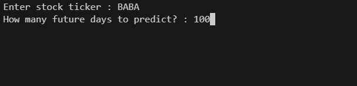
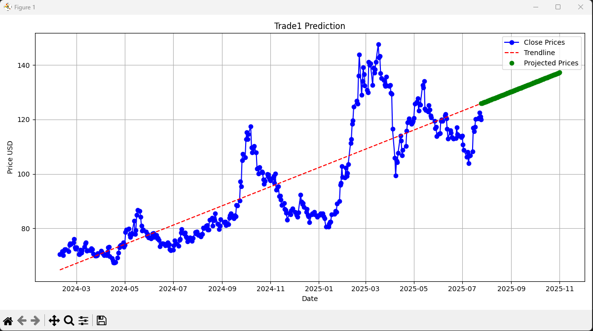

# Trade1 — Stock Price Predictor

A command-line tool that fetches historical stock data and projects future prices using linear regression.

## How It Works

1. User enters a stock ticker (e.g. `AAPL`, `TSLA`) and a number of days to forecast.
2. The app pulls the last year of daily closing prices from Yahoo Finance.
3. A linear regression model fits the historical data and extrapolates forward.
4. Results are displayed in a matplotlib chart showing historical prices, trendline, and projected prices.

## Requirements

- Python 3.8+
- yfinance
- matplotlib
- scikit-learn

Install dependencies:

```
pip install yfinance matplotlib scikit-learn
```

## Usage

```
python trade1.1.py
```

You'll be prompted for a ticker symbol and forecast length.

## Screenshots




## Limitations

- Linear regression assumes a straight-line trend — it won't capture volatility, cycles, or market events.
- Predictions are for educational/exploratory purposes, not financial advice.
